# Introduction 
Distracted driving is a major concern, as it is the cause of many accidents, injuries and deaths. These distractions can significantly impair a driver's ability to focus on the road, react quickly to potential hazards, and make safe driving decisions. Statistical data from the CDC's Motor Vehicle Safety Division shows that about one in five car accidents is caused by driver distraction. 
With the emergence of artificial intelligence, we can now detect various human behavior in public spaces (streets, parks, ...) or closed spaces (malls, houses, cars, ...). 

In this context, we propose a new method to study the driver's behavior by detecting his distractions. The proposed solution relies on advanced technologies such as computer vision and machine learning to mitigate accident risks and enhance road safety.
Since it is a critical task that affects people's lives, the proposed solution need to be precise and fast when predicting behavior so we can later generate alerts as soon as an unsafe action happens.
The project aims to explore different computer vision approaches  to recognize the activity of the driver with the highest accuracy and as near as possible to real-time.

# DataSet 
The StateFarm distraction-detection dataset is selected for our human activity project.This dataset is obtained from Kaggle : ``State Farm Distracted Driver Detection competition``
| Class | Driver Behavior            | Number of images |
|-------|---------------------------|-----------------|
| C0    | Safe Driving              | 2489            |
| C1    | Texting-Right             | 2267            |
| C2    | Talking on the Phone-Right| 2317            |
| C3    | Texting Left              | 2346            |
| C4    | Talking on the Phone-Left | 2326            |
| C5    | Operating the radio       | 2312            |
| C6    | Drinking                  | 2325            |
| C7    | Reaching Behind           | 2002            |
| C8    | Hair and Makeup           | 1911            |
| C9    | Talking to Passenger      | 2129            |

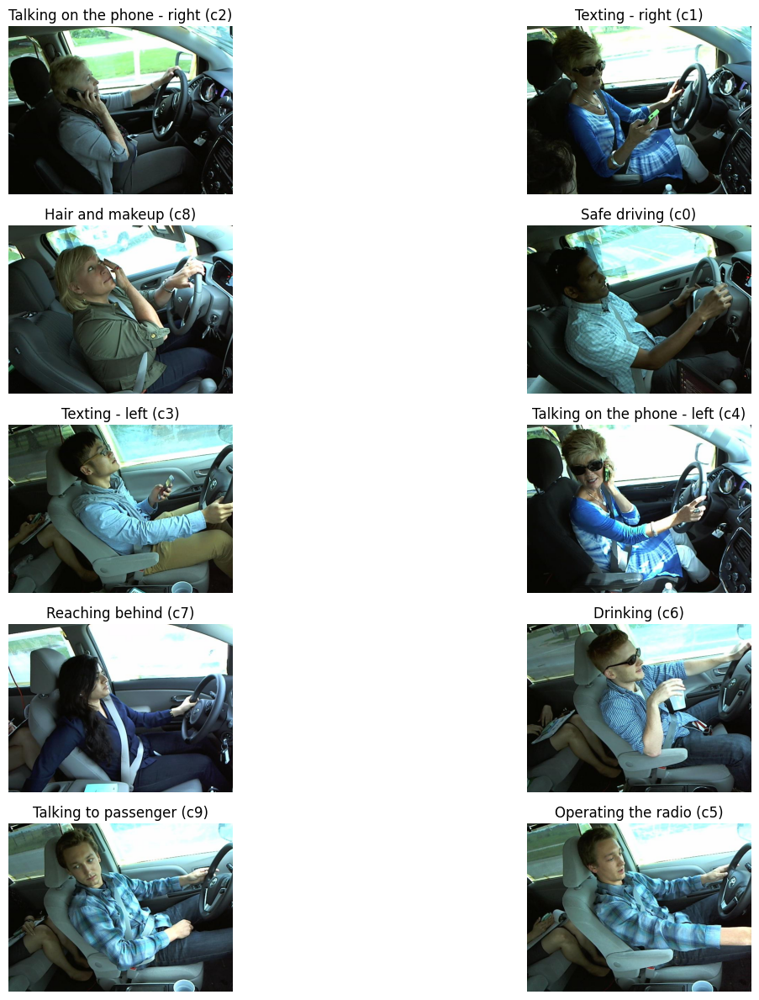

# Modeling 
we used different Architecture like show above : 
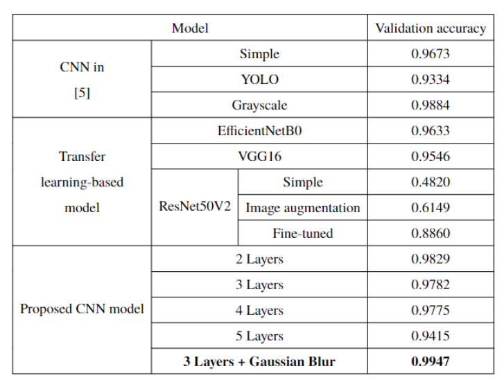

# Deployment 
## Project Architecture
The project architecture consists of a Flask backend that exposes prediction endpoints, a registered model for generating predictions, and a frontend that allows users to upload images and receive the prediction results from the backend.

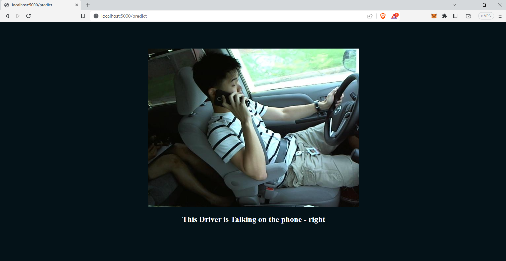

## Project Hierarchy 
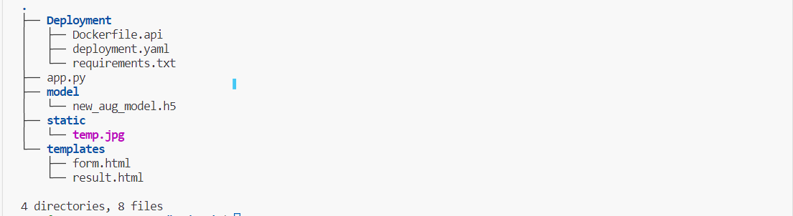

| File            | Definition                                                               |
|-----------------|--------------------------------------------------------------------------|
| Dockerfile.api  | Instructions for building a Docker image for the Flask API.               |
| deployment.yaml | Kubernetes deployment configuration                                      |
| requirements.txt| Text file listing the required Python dependencies for the Flask application. |
| app.py          | Main Python file for the Flask application. It contains the backend logic and API endpoints. |
| form.html       | HTML template for the form page where users can upload images.            |
| model.h5        | The trained deep learning model file                                     |
| result.html     | HTML template for the result page where the prediction results are displayed. |

## Deploying locally in kubernetes cluster (Minikube)
### Pre-requirements
* Minikube v1.29.0
* Docker 20.10.23
* kubectl  v5.0.1


### Dockerizing the flask api
Create the Dockerfile that Docker will read to build and run the model:
* Dockerfile.api
``` FROM python:3.9
WORKDIR /FlaskApp
COPY requirements.txt .
ENV FLASK_ENV production
EXPOSE 5000
RUN pip install -r ./requirements.txt
COPY . .
CMD ["python", "appy"]
```
This Dockerfile can be broken down into three steps. First, it creates the Dockerfile and instructs Docker to download a base image of Python 3. Next, it asks Docker to use the Python package manager pip to install the packages in requirements.txt. Finally, it tells Docker to run your script via python app.py.

* Build the Docker container:
``` docker build -f Dockerfile.api -t flask-dl-api ```
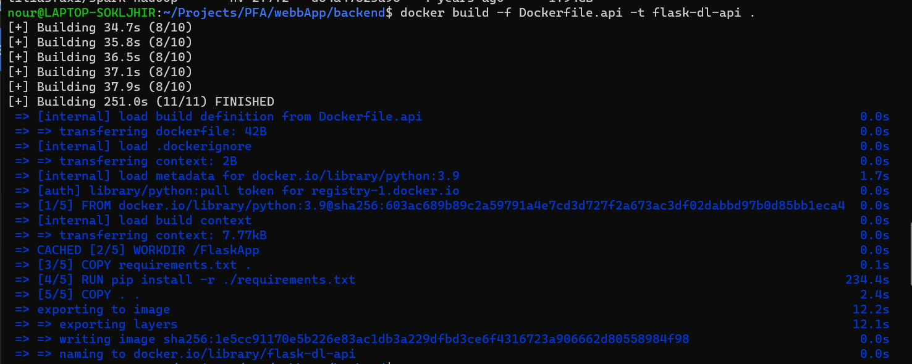

This instructs Docker to build a container for the code in your current working directory
* Check that your container is working by running it on your local machine:
``` sudo docker run  -p 5000:5000 flask-dl-api ```
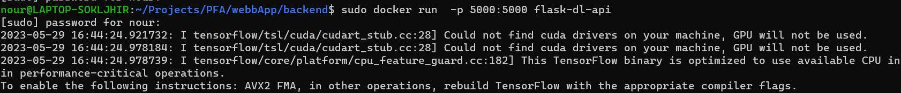

### Deploying the container to a k8s cluster
To run the container in the cluster, you need to create a deployment (deployment.yaml) and apply it to the cluster:  
* Deployement.YAML
``` ```

``` minikube start ```

``` kubectl apply -f deployment.yaml ```
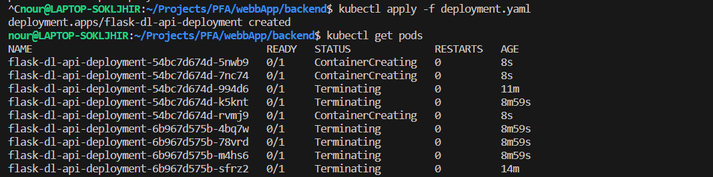
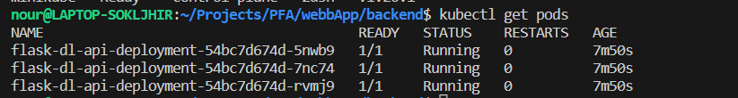

### Exposing the container deployment to the outside world
``` kubectl expose deployment kubermatic-dl-deployment  --type=LoadBalancer --port 80 --target-port 5000 ```
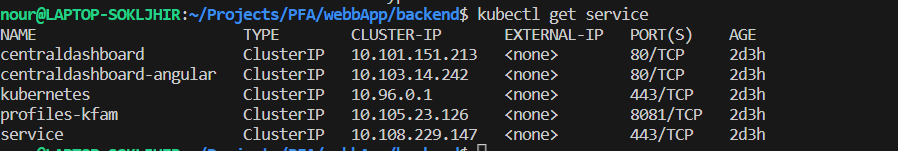
``` minikube tuneel ```
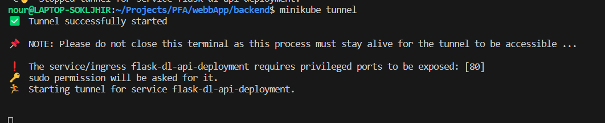

To check your services to determine the status of your deployment and get the IP address to call your image recognition API:

``` kubectl get service ```
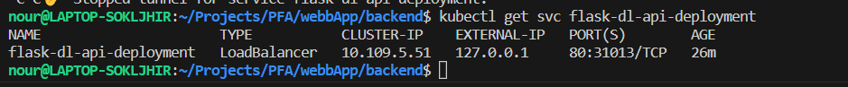
